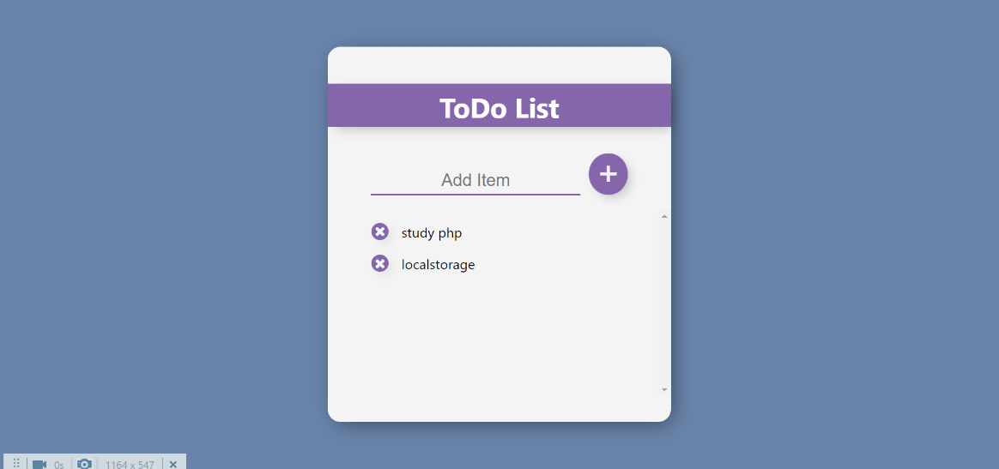

This is a simple Todo application built using React.

## Features
Add a new task
Edit existing tasks
Mark tasks as completed
Delete tasks

## Installation
Clone the repository to your local machine.
Navigate to the project directory.
Run npm install to install dependencies.
Run npm start to start the application.

## Usage
To add a new task, type in the task and press the "Add" button or hit enter.
To edit an existing task, click on the task and make your changes. Press the "Save" button to save the changes or press "Cancel" to discard them.
To mark a task as completed, click on the checkbox next to the task.
To delete a task, click on the trash can icon next to the task.
Technologies Used
React
React Hooks
HTML
CSS
JavaScript

## Credits
This project was inspired by TodoMVC and was built by [Your Name] using React.

## License
This project is licensed under the MIT License - see the LICENSE.md file for details.